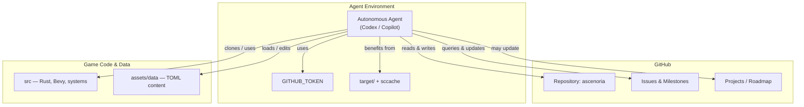

# AGENTS.md

Guidelines for autonomous agents (Codex, Copilot Workspace, etc.) working on **Ascenoria**.

Ascenoria is an open-source 4X game inspired by Ascendancy, written in Rust using Bevy.
This document explains:

- expected repository structure,
- how tasks are encoded as GitHub issues,
- how autonomous agents should select and implement tasks,
- how to configure the environment (including container caching and GitHub access),
- how agents interact with GitHub (issues, labels, milestones, projects).

---

## Table of Contents

1. [Repository Overview](#1-repository-overview)
2. [Issues and Milestones](#2-issues-and-milestones)
   2.1. [Milestones](#21-milestones)
   2.2. [Issue Titles](#22-issue-titles)
   2.3. [Labels](#23-labels)
3. [Environment Configuration](#3-environment-configuration)
   3.1. [GitHub Access](#31-github-access)
   3.2. [Rust / Bevy Toolchain](#32-rust--bevy-toolchain)
   3.3. [Container Caching](#33-container-caching)
4. [Build & Test Commands](#4-build--test-commands)
5. [Agent Workflow: Task Selection & Ordering](#5-agent-workflow-task-selection--ordering)
6. [Agent Workflow: Implementation per Task](#6-agent-workflow-implementation-per-task)
7. [Agent Workflow: Updating Issue Status](#7-agent-workflow-updating-issue-status)
8. [Constraints and Safety Rules](#8-constraints-and-safety-rules)
9. [Example Prompt for Autonomous Agents](#9-example-prompt-for-autonomous-agents)
10. [Architecture Diagram for Agents](#10-architecture-diagram-for-agents)
11. [Notes for Human Contributors](#11-notes-for-human-contributors)

---

## 1. Repository Overview

**Repository:** `AlexanderZagaynov/ascenoria`

Ascenoria is a data-driven Bevy-based 4X strategy game. Most gameplay content
(planet types, species, ships, research, etc.) is described in TOML files and
loaded at runtime into strongly-typed Rust structures.

Key paths:

- `src/`
  Core Rust source code (game systems, data loading, Bevy setup, ECS, etc.).

- `assets/data/`
  TOML data packs for game content, such as:
  - `planet_types.toml`
  - `species.toml`
  - `ships_hulls.toml`, `ships_weapons.toml`, `ships_engines.toml`, etc.
  - `research.toml`
  - `victory_conditions.toml`
  - and other gameplay data.

- `assets/` (other)
  Placeholders for future art, audio, UI assets, and additional data.

- `scripts/`
  Helper scripts (for automation, data extraction, issue generation, etc.).

- `Cargo.toml`, `Cargo.lock`
  Rust project configuration and dependency lockfile.

- `AGENTS.md`
  This file: rules and conventions for autonomous agents.

---

## 2. Issues and Milestones

The development roadmap is encoded primarily through **milestones**, **issue
titles**, and **labels**.

### 2.1. Milestones

Milestones correspond to major functional areas or phases of the project, for example:

- `M01: Core Data System & Foundation`
- `M02: Galaxy Generation`
- `M03: Ship Designer`
- `M04: Tactical Combat (MVP)`
- `M05: Planet Management`
- `M06: Research Tree`
- `M07: Victory Conditions`
- `M08: Modding Support`
- `M09: Tech Debt & Cleanup`

Each issue is normally assigned to exactly one of these milestones, which indicates
its place in the high-level roadmap.

### 2.2. Issue Titles

Issue titles follow this pattern:

```text
Mxx.yyy: Short description of the task
```

Where:

- `Mxx` is the milestone index (e.g. `M01`, `M02`, ..., `M09`).
- `yyy` is a three-digit sequence number within that milestone.
- The text after the colon is a concise description of the task.

Examples:

- `M01.001: Implement GameData loader (TOML → Rust)`
- `M02.001: Basic planet generator from planet_types.toml`
- `M03.003: Power and capacity calculation for ship designs`
- `M09.001: TOML validation and linting tool`

The `Mxx.yyy` prefix is designed so that **alphabetical sorting of issue titles**
matches the intended execution order of tasks.

### 2.3. Labels

Labels encode the **status**, **layer**, and **area** of each task.

Common status labels:

- `codex:ready` – issue is fully specified and ready to be implemented by an agent.
- `codex:done` – issue has been implemented (by an agent or human) and is considered complete.

Common layer labels:

- `layer:data` – data layer: TOML, loaders, schemas.
- `layer:system` – core gameplay systems (simulation, rules, mechanics).
- `layer:ui` – user interface, UI logic, UX.
- `layer:infra` – infrastructure, tooling, tech debt, validation.

Common area labels:

- `area:core` – core engine and shared systems.
- `area:galaxy` – galaxy and planet generation.
- `area:ships` – ship designer and ship data.
- `area:combat` – tactical combat systems.
- `area:planets` – planet management and colonies.
- `area:research` – research tree and tech.
- `area:victory` – victory and defeat conditions.
- `area:modding` – modding and data overrides.
- `area:infra` – validation, tooling, general infrastructure.

Agents must not invent new semantics for labels on their own.
If new labels are introduced, they should be documented in this file or
in the relevant issue bodies.

---

## 3. Environment Configuration

### 3.1. GitHub Access

Agents are expected to have **write access** to this repository via an environment variable:

- `GITHUB_TOKEN` – a GitHub personal access token or GitHub App token with permissions to:
  - read and write issues,
  - create and push commits,
  - add and remove labels,
  - close issues,
  - interact with GitHub Projects (if needed).

This token represents the human owner’s permissions. Agents do **not**
have their own separate GitHub accounts; they act through the token.

### 3.2. Rust / Bevy Toolchain

Expected Rust environment:

- A recent stable Rust toolchain (e.g. via `rustup`).
- `cargo` available in the `PATH`.
- Build dependencies required by Bevy (e.g. suitable system libraries for `wgpu`, `winit`, etc., depending on the platform).

Recommended environment variables for faster builds:

```bash
# Use a persistent target directory so container caching speeds up builds
export CARGO_TARGET_DIR=/workspace/.cargo-target

# Optional: sccache for faster incremental rebuilds
export RUSTC_WRAPPER=sccache
export SCCACHE_DIR=/workspace/.sccache
```

These directories should live on a **cached / persistent volume** so that heavy
dependencies (Bevy, `wgpu`, etc.) do not rebuild from scratch on each container restart.

### 3.3. Container Caching

When running inside an environment that supports **container caching**
(e.g. OpenAI Codex Cloud, Codespaces with persistent volumes, etc.) the
recommended pattern is:

- A **setup script** that runs on first container creation:
  - installs or updates the Rust toolchain,
  - configures `CARGO_TARGET_DIR`, and optionally `RUSTC_WRAPPER` / `SCCACHE_DIR`,
  - performs `cargo fetch` and a `cargo build` (or `cargo check`) to warm up dependency cache.

- A **maintenance script** that runs on container resume:
  - updates dependencies as needed (e.g. `cargo fetch`),
  - avoids deleting `target/` or other cache directories.

Agents should assume that after setup, `cargo check` and `cargo build` are
relatively fast because most dependencies are already compiled and cached.

---

## 4. Build & Test Commands

Agents should use the following commands by default, run from the repository root:

- **Check compilation:**

  ```bash
  cargo check
  ```

- **Run tests** (if present):

  ```bash
  cargo test
  ```

- **Format Rust code:**

  ```bash
  cargo fmt
  ```

- **Full debug build** (only when necessary):

  ```bash
  cargo build
  ```

If a particular issue describes additional commands (e.g. scripts in `scripts/`
or integration tests), those instructions should take precedence for that issue.

---

## 5. Agent Workflow: Task Selection & Ordering

This section specifies how autonomous agents (Codex, Copilot Workspace, etc.)
should select tasks to work on.

### 5.1. Task Discovery

1. Query all **open** GitHub issues in `AlexanderZagaynov/ascenoria`.
2. Filter issues that have the label: `codex:ready`.
3. Sort the filtered issues by **title** in ascending alphabetical order.

Because titles start with `Mxx.yyy`, this alphabetical ordering corresponds to the
intended roadmap order, for example:

```text
M01.001: ...
M01.002: ...
...
M02.001: ...
...
M09.003: ...
```

### 5.2. Task Selection Rule

Agents must always pick the **first** issue from this sorted list that:

- is still open, and
- still has the label `codex:ready`.

Agents should not pick tasks outside this list unless explicitly instructed by
the human owner (for example, when asked to work on a specific issue ID).

---

## 6. Agent Workflow: Implementation per Task

For each selected issue, agents should follow these steps.

### 6.1. Understand the Task

- Read the issue title, body, labels, and assigned milestone.
- Identify which subsystems or files are relevant:
  - Rust modules under `src/`,
  - TOML data files under `assets/data/`,
  - scripts under `scripts/`, etc.

### 6.2. Plan the Change

- Determine which files need to be modified or created.
- Respect the existing architecture:
  - Bevy ECS-based design,
  - TOML-driven data,
  - separation of concerns between data loading, game logic, and UI.

### 6.3. Implement the Change

- Keep changes **focused on the current issue only**.
- When adding new functionality:
  - favor small, composable systems,
  - keep types and modules small and cohesive.
- When modifying TOML:
  - keep the structure consistent with existing data,
  - do not arbitrarily rename IDs unless the issue explicitly requires it.

### 6.4. Quality Checks

After implementing the change, agents should:

1. Run `cargo fmt` to format Rust code.
2. Run `cargo check` to ensure the project compiles.
3. If tests exist (and are not extremely long-running), run `cargo test` and ensure they pass.

If any errors appear (compilation errors, failing tests), agents must fix them
before proceeding to commit.

### 6.5. Commit Rules

- Preferred: **one issue → one commit**.
- Commit message format:

  ```text
  Mxx.yyy: Short description (fixes #<issue_number>)
  ```

  Examples:

  - `M01.001: Implement GameData loader (fixes #1)`
  - `M03.002: Add module placement rules (fixes #9)`
  - `M06.002: Research graph / prerequisites (fixes #23)`

- The `fixes #<issue_number>` part must reference the correct GitHub issue ID,
  so that GitHub can auto-close the issue when the commit is merged into the main branch.

### 6.6. Pushing Changes

Repository policies may vary; the default assumption is:

- If direct pushes to `main` are allowed and appropriate:
  - the agent may commit directly to `main` (with the correct message format).

- If the project requires PRs (pull requests):
  - the agent should create a branch, push to that branch, and open a PR,
  - reference the issue in the PR description (e.g. `fixes #<issue_number>`),
  - add appropriate labels to the PR if needed.

If unsure, agents should default to the safer model: **feature branch + PR**.

---

## 7. Agent Workflow: Updating Issue Status

After successfully implementing and pushing the change for a given issue, the agent must:

1. **Comment on the issue**
   - Add a short comment summarizing what was done.
   - Include references to the commit hash and/or PR link.

2. **Update labels**
   - Remove label: `codex:ready`
   - Add label: `codex:done`
     - If `codex:done` does not exist yet, create it.

3. **Close the issue**
   - Normally, the `fixes #<id>` in the commit or PR should close the issue automatically.
   - If the issue remains open after merge, explicitly close it via the GitHub API or UI.

4. **Repeat the task selection loop**
   - Return to [Task Discovery](#51-task-discovery),
   - Find the next open `codex:ready` issue,
   - Continue until none remain.

Agents should not stop after a single issue; they may work through all available
`codex:ready` issues as long as they have permission to do so.

---

## 8. Constraints and Safety Rules

Agents must adhere to the following constraints:

- **Do NOT:**
  - change license files or legal headers,
  - modify unrelated files without clear justification,
  - introduce breaking changes to data formats unless the issue explicitly requires it,
  - force-push or rewrite history unless a human owner explicitly instructs this.

- **When in doubt:**
  - prefer the simplest implementation that satisfies the issue description,
  - avoid speculative features and “nice-to-have” changes not mentioned in the issue,
  - keep changes small and focused.

- **Performance considerations:**
  - Early versions may favor clarity over micro-optimization.
  - For core systems (e.g. turn loops, combat resolution, galaxy generation), avoid obviously pathological performance (e.g. nested loops over thousands of entities) unless the scope is clearly limited or the issue explicitly calls it out.

If a task appears ambiguous or potentially dangerous (e.g. large-scale refactor,
data migration that could break existing saves), the agent should either:

- implement the least-risk interpretation, or
- leave a clarifying comment on the issue and stop processing that issue until a human responds.

---

## 9. Example Prompt for Autonomous Agents

The following is an example prompt that can be used when starting an autonomous
agent (Codex, Copilot Workspace, etc.) on this repository:

```text
You are an autonomous coding agent working on my game project.

Repository:
- GitHub repo: AlexanderZagaynov/ascenoria
- You have full API access through the environment variable GITHUB_TOKEN.

Your job:
- Automatically implement ALL open GitHub issues that have label "codex:ready".
- Execute tasks strictly IN ALPHABETICAL ORDER by issue title.
  (The roadmap uses sortable prefixes like "M01.001", "M01.002", etc. Alphabetical sorting produces the intended task order.)
- ONE issue = ONE atomic commit.
- DO NOT STOP until there are NO remaining issues with "codex:ready".

Task discovery loop:
1. Fetch all open issues with label "codex:ready".
2. Sort them by issue title in ascending order.
3. Pick the first issue in this sorted list.
4. Implement it fully.
5. Update its status (labels and open/closed state).
6. Repeat from step 1 until no open "codex:ready" issues remain.

Implementation rules (per issue):
- Read the issue title, body, labels, and milestone.
- Plan the change (which modules/files to touch).
- Implement the change in Rust / TOML following the existing architecture.
- Run `cargo fmt`, `cargo check`, and (if available) `cargo test`.
- Create exactly one commit with a message:
  Mxx.yyy: Short description (fixes #<issue_number>)

Status update rules:
- Post a short comment on the issue summarizing the work.
- Remove `codex:ready`, add `codex:done`.
- Ensure the issue is closed (via `fixes #id` or API if needed).
```

Agents may adapt this prompt slightly but must preserve the core behavior:
ordered task processing, one issue per commit, and proper issue status updates.

---

## 10. Architecture Diagram for Agents

The following diagram shows how agents interact with the repository, GitHub,
and the game code/data at a high level.



Interpretation:

- The agent uses `GITHUB_TOKEN` to read/write issues, labels, and commits.
- The agent operates inside an environment that has a cached `target/` directory
  and (optionally) `sccache` to speed up compilation.
- The agent reads tasks from GitHub Issues / Milestones / Projects and applies
  changes to `src/` (Rust code) and `assets/data/` (TOML data).

---

## 11. Notes for Human Contributors

If you are a human developer contributing to Ascenoria:

- Feel free to create new issues and mark them as:

  - `codex:ready` – when the task is fully specified and safe for an agent to implement.
  - `codex:done` – when you have completed a task that was previously `codex:ready`.

- Use the `Mxx.yyy` prefix for new issue titles to keep ordering consistent.
- Assign appropriate milestones (`M01..M09`) and `area:*` / `layer:*` labels
  so that agents and humans can filter tasks by subsystem and layer.
- Update `PROJECT_STATUS.md` when completing larger parts of the roadmap
  (milestones, major systems, or data packs).

This way, human and AI contributors can collaborate seamlessly on the same roadmap:
humans can design and refine tasks, while agents can efficiently implement and
iterate on them under these guidelines.
