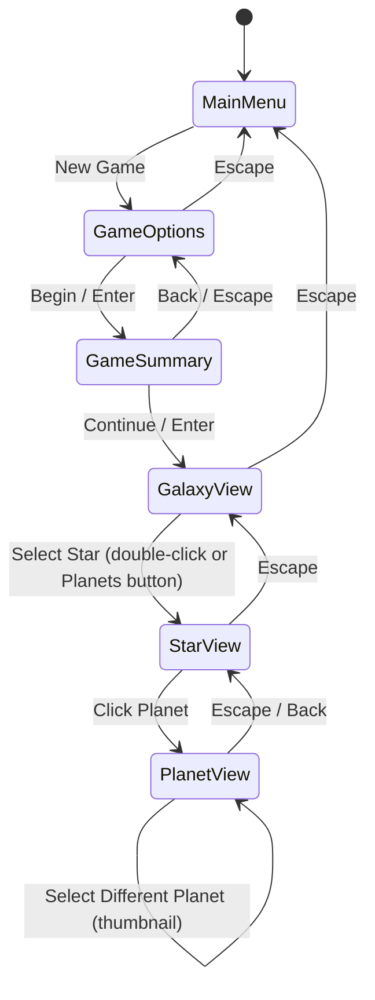

# Ascenoria Screen State Machine

This document describes the screen navigation hierarchy in Ascenoria.

## Game States

The game has the following states defined in `src/main_menu/mod.rs`:

| State | Description |
|-------|-------------|
| `MainMenu` | Initial screen with New Game, Load, Save, Exit |
| `GameOptions` | Species selection and game configuration |
| `GameSummary` | Pre-game briefing showing selected species info |
| `GalaxyView` | Main galaxy map view |
| `StarView` | Star system view showing planets |
| `PlanetView` | Individual planet surface view |

## State Transitions

## Transition Details

### From MainMenu
- **New Game** → `GameOptions`: Click "New Game" button

### From GameOptions
- **Escape** → `MainMenu`: Press Escape key
- **Begin/Enter** → `GameSummary`: Click "Begin" button or press Enter

### From GameSummary
- **Back/Escape** → `GameOptions`: Click "Back" button or press Escape
- **Continue/Enter** → `GalaxyView`: Click "Continue" button or press Enter/Space

### From GalaxyView (Galaxy Map)
- **Escape** → `MainMenu`: Press Escape key
- **Double-click Star** → `StarView`: Double-click on a star
- **Planets Button** → `StarView`: Select star then click Planets panel button

### From StarView
- **Escape** → `GalaxyView`: Press Escape key to return to galaxy map
- **Click Planet** → `PlanetView`: Click on a planet sprite

### From PlanetView
- **Escape/Back** → `StarView`: Press Escape or click Back button
- **Thumbnail Click** → `PlanetView`: Re-enters with different planet selected

## Notes

- `LoadGame` and `SaveGame` functionality is planned but not yet implemented
- The `GalaxyView` state represents the galaxy map view where the player manages their empire
